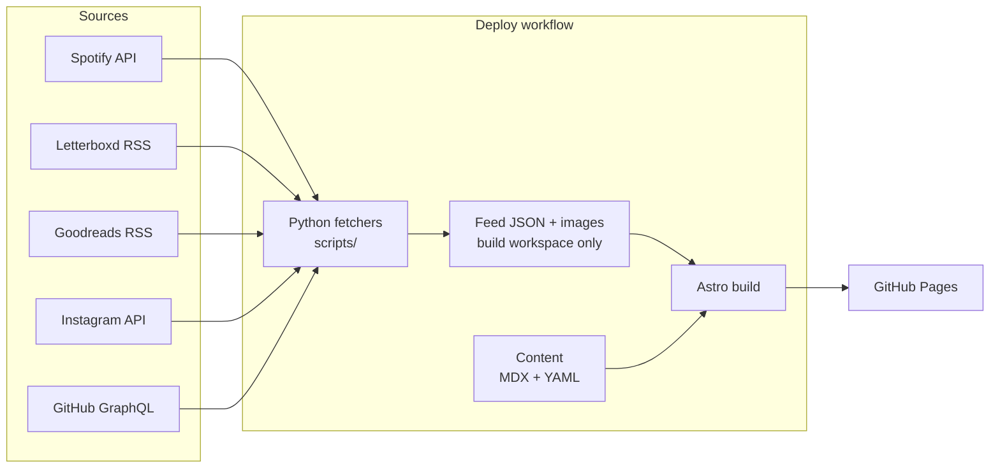

# a slow feed

A personal site that collects what I listen to, watch, read, photograph, build
and cook, one quiet shelf at a time.

**Live:** [vitellaro-matteo.github.io](https://vitellaro-matteo.github.io/) (launching soon)

[](https://github.com/vitellaro-matteo/vitellaro-matteo.github.io/actions/workflows/ci.yml)


## Features

- **Self-updating home page:** last week's Spotify finds, recent Letterboxd
  films, the book on the nightstand, Instagram photos and a GitHub contribution
  calendar, refreshed every morning by Python fetchers. If a source fails, the
  card shows the last good copy, or steps aside and the grid repacks itself.
- **Journal** of notes and essays in MDX, with embeddable tracks, films, books
  and recipes, and margin notes that sit beside the paragraph they annotate.
- **Cooking log** of recipes followed from elsewhere, always credited, with my
  own notes and what I changed.
- **Around-the-world challenge:** one national dish for each of 195 countries,
  on an Equal Earth world map rendered to static SVG at build time, with
  keyboard-accessible tooltips and a full list by continent.
- **Yearly top tens** of songs, albums, films and books.
- **RSS feed and sitemap.** All content is validated at build time: a typo in
  frontmatter or in the country list fails the build with a clear message.

## How the data flows



Feeds are fetched on every deploy (daily at 05:00 UTC, on push and on demand)
and never committed. Each fetcher is independent: the last good output is kept
in the Actions cache, so one broken source never takes the others down. In
development and CI the site runs on sample fixtures of the same shape, which
never reach production.

## Design system

A warm, paper-like palette, one serif for display, one sans for reading and a
mono for metadata. The full specification, with every value and page layout,
is in **[docs/DESIGN.md](docs/DESIGN.md)**.

| Token      | Hex       | Use                                     |
| ---------- | --------- | --------------------------------------- |
| `--paper`  | `#F3EFE7` | Page background                         |
| `--card`   | `#FAF8F4` | Card background                         |
| `--kraft`  | `#E6DECF` | Bands, placeholders, uncooked countries |
| `--line`   | `#DDD5C6` | Borders and rules                       |
| `--ink`    | `#2A2724` | Text                                    |
| `--muted`  | `#5F5850` | Secondary text                          |
| `--accent` | `#9C4A32` | Labels, active states, cooked countries |

| Role    | Typeface            | Sizes                                        |
| ------- | ------------------- | -------------------------------------------- |
| Display | Shippori Mincho 400 | 72 · 56 · 50 · 40 · 32 · 26 · 22 · 20 · 18px |
| Body    | Instrument Sans 400 | 18 · 16 · 15 · 14px                          |
| Meta    | IBM Plex Mono 400   | 12px, 0.06em tracking, always lowercase      |

**Principles:** no radii, shadows, gradients, emoji or icons; one accent colour;
hover changes colour and nothing else; every image has a kraft placeholder behind
it; touch targets are at least 44px.

## Tech stack

- **[Astro](https://astro.build)**: static output, content collections, MDX
- **TypeScript** (strict) and **Zod** schemas for all content and data files
- **Plain CSS** with custom properties; no UI framework
- **d3-geo, topojson-client and topojson-simplify** for the build-time SVG map
- **Python 3.10+** fetchers (`requests`, `defusedxml`), checked with ruff, mypy
  (strict) and pytest against saved API responses
- **Vitest** for the TypeScript helpers
- **ESLint** (typescript-eslint, astro, jsx-a11y) and **Prettier**
- **GitHub Actions** for CI and a daily deploy, **GitHub Pages** for hosting

## Project structure

```
.
├── site.config.ts          every site-specific value
├── astro.config.ts
├── src/
│   ├── components/         layout pieces, home cards, map, MDX embeds
│   ├── content/            journal posts, recipes, yearly lists
│   ├── content.config.ts   Zod schemas for all content
│   ├── data/               now.yaml, countries.yaml, sample feed fixtures
│   ├── layouts/            the page shell
│   ├── lib/                typed, tested helpers (dates, paths, feeds, map, …)
│   ├── pages/              routes and the RSS feed
│   └── styles/             design tokens and global CSS
├── scripts/                Python fetchers (one per source + fetch_all), Spotify token helper
├── tests/                  pytest suite and saved API responses
├── public/media/           photos and cover art
├── docs/                   DESIGN, CONTENT and SETUP guides
└── .github/workflows/      CI and deploy
```

## Decisions

- **Static over SSR.** Everything on the site changes at most once a day, so a
  daily static build is simpler, faster and free to host. There is no server to
  keep alive or secure.
- **Feeds fetched at build time, not committed.** Committing daily data would
  bury real changes under bot commits and force a rebase before every push.
  Fetching in the deploy workflow keeps history clean. Committed fixtures keep
  development and CI working without secrets, but never reach production.
- **No UI framework.** The site ships almost no JavaScript (list tabs and the
  map tooltip so far), so plain CSS and Astro components are enough. The design
  system is a handful of custom properties rather than a dependency.
- **Build-time map rendering.** The world map is simplified, projected and
  written as compact SVG paths during the build. Visitors get about 45 KB of
  inline SVG (26 KB gzipped for the whole challenge page) instead of a map
  library plus 750 KB of country geometry.
- **One place for configuration.** Every username, URL and path lives in
  `site.config.ts`, and every internal link goes through one path helper, so
  moving the site to a sub-path or a custom domain is a one-line change.

## Roadmap

- [x] Design system, home page, journal, lists and cooking pages
- [x] Around-the-world map and challenge page
- [x] Python fetchers and the deploy workflow (daily refresh, cached fallbacks)
- [ ] Mobile layout and accessibility pass (Lighthouse ≥ 95)

## Quick start

```sh
npm install
npm run dev
```

Open <http://localhost:4321/>. See [docs/SETUP.md](docs/SETUP.md) for
configuration and secrets, and [docs/CONTENT.md](docs/CONTENT.md) for writing
posts, recipes and lists.

## License

[MIT](LICENSE) © Matteo Vitellaro
