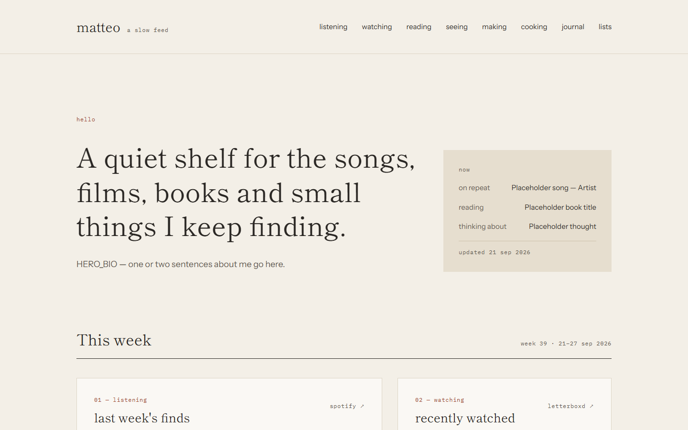
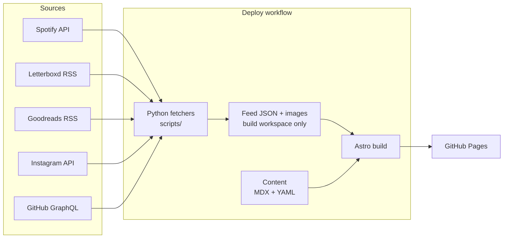

# a slow feed

A personal site that quietly collects what I listen to, watch, read, photograph,
build and cook, and updates itself every morning.

**Live:** [vitellaro-matteo.github.io/blog](https://vitellaro-matteo.github.io/blog/) (launching soon)

[](https://github.com/vitellaro-matteo/blog/actions/workflows/ci.yml)



## Features

- **Self-updating home page:** last week's Spotify finds, recent Letterboxd films,
  the book on the nightstand, Instagram photos and a GitHub contribution
  calendar, refreshed daily with no manual work.
- **Journal** of notes and essays in MDX, with embeddable tracks, films, books
  and recipes, and margin notes that sit beside the paragraph they annotate.
- **Cooking log** of recipes followed from elsewhere, always credited, with my
  own notes and what I changed.
- **Around-the-world challenge:** one national dish per country, tracked on a
  world map rendered to static SVG at build time.
- **Yearly top tens** of songs, albums, films and books, written each December.
- **RSS feed and sitemap**, validated content (a typo in frontmatter fails the
  build with a clear message), and a site that works without JavaScript.

## How the data flows



Feeds are fetched on every deploy (daily, on push and on demand) and never
committed. Locally and in CI the site builds from sample fixtures of the same
shape.

## Design system

A warm, paper-like palette, one serif for display, one sans for reading and a
mono for metadata. The full specification, with every value and page layout,
is in **[docs/DESIGN.md](docs/DESIGN.md)**.

| Token      | Hex       | Use                                     |
| ---------- | --------- | --------------------------------------- |
| `--paper`  | `#F3EFE7` | Page background                         |
| `--card`   | `#FAF8F4` | Card background                         |
| `--kraft`  | `#E6DECF` | Bands, placeholders, uncooked countries |
| `--line`   | `#DDD5C6` | Borders and rules                       |
| `--ink`    | `#2A2724` | Text                                    |
| `--muted`  | `#5F5850` | Secondary text                          |
| `--accent` | `#9C4A32` | Labels, active states, cooked countries |

| Role    | Typeface            | Sizes                                        |
| ------- | ------------------- | -------------------------------------------- |
| Display | Shippori Mincho 400 | 72 · 56 · 50 · 40 · 32 · 26 · 22 · 20 · 18px |
| Body    | Instrument Sans 400 | 18 · 16 · 15 · 14px                          |
| Meta    | IBM Plex Mono 400   | 12px, 0.06em tracking, always lowercase      |

**Principles:** no radii, shadows, gradients, emoji or icons; one accent colour;
hover changes colour and nothing else; every image has a kraft placeholder behind
it; touch targets are at least 44px.

## Tech stack

- **[Astro](https://astro.build)**: static output, content collections, MDX
- **TypeScript** (strict) and **Zod** schemas for all content
- **Plain CSS** with custom properties; no UI framework
- **Python 3.10+** fetchers, checked with ruff, mypy (strict) and pytest
- **d3-geo + topojson** for a build-time SVG world map
- **GitHub Actions** for CI and deploys, **GitHub Pages** for hosting
- ESLint (typescript-eslint, astro, jsx-a11y) and Prettier

## Project structure

```
.
├── site.config.ts          every site-specific value
├── astro.config.ts
├── src/
│   ├── components/         layout pieces, home cards, MDX embeds
│   ├── content/            journal posts, recipes, yearly lists
│   ├── content.config.ts   Zod schemas for all content
│   ├── data/               now.yaml and sample feed fixtures
│   ├── layouts/            the page shell
│   ├── lib/                typed helpers: feeds, dates, paths, content queries
│   ├── pages/              routes and the RSS feed
│   └── styles/             design tokens and global CSS
├── scripts/                Python fetchers
├── public/media/           photos and cover art
├── docs/                   DESIGN, CONTENT and SETUP guides
└── .github/workflows/      CI
```

## Decisions

- **Static over SSR.** Everything on the site changes at most once a day, so a
  daily static build is simpler, faster and free to host. There is no server to
  keep alive or secure.
- **Feeds fetched at build time, not committed.** Committing daily data would
  bury real changes under bot commits and force a rebase before every push.
  Fetching in the deploy workflow keeps history clean; committed fixtures keep
  local builds and CI working without any secrets.
- **No UI framework.** The site ships almost no JavaScript (tabs, map tooltips,
  a mobile menu), so plain CSS and Astro components are enough. The design
  system is a handful of custom properties rather than a dependency.
- **Build-time map rendering.** The world map is projected and drawn to SVG
  during the build, so visitors download a small static image instead of a map
  library and 50m country geometry.
- **One place for configuration.** Every username, URL and path lives in
  `site.config.ts`, and every internal link goes through one path helper, so
  moving from `/blog/` to a custom domain is a one-line change.

## Quick start

```sh
npm install
npm run dev
```

Open <http://localhost:4321/blog/>. See [docs/SETUP.md](docs/SETUP.md) for
configuration and secrets, and [docs/CONTENT.md](docs/CONTENT.md) for writing
posts, recipes and lists.

## License

[MIT](LICENSE) © Matteo Vitellaro
